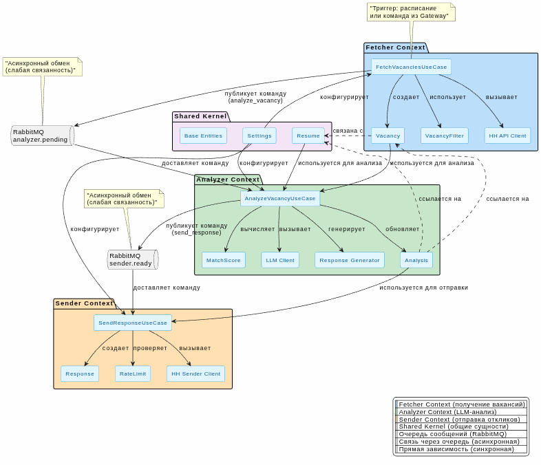

# Проектирование на основе DDD (Domain-Driven Design)

## 1. Введение
Документ описывает предметную область системы "Ahaha" через призму DDD. Основная цель — создать общий язык между разработчиками и заказчиком, а также определить четкие границы контекстов для последующей реализации.

## 2. Общее описание предметной области
Пользователь (Соискатель) имеет несколько **Резюме**. Система ищет **Вакансии** на HeadHunter, анализирует их соответствие каждому резюме и, при необходимости, отправляет **Отклик**.

## 3. Стратегическое проектирование (Bounded Contexts)

### 3.1. Идентификация ограниченных контекстов

| Контекст | Описание | Ключевые сущности |
|----------|----------|-------------------|
| **Управление вакансиями** | Получение, фильтрация и хранение вакансий из внешних источников. | Vacancy, VacancyFilter |
| **Анализ соответствия** | Оценка релевантности вакансии для резюме с помощью LLM. | Analysis, MatchScore, Resume |
| **Отправка откликов** | Управление процессом отправки, контроль лимитов и статусов. | Response, RateLimit |
| **Настройки системы** | Управление конфигурацией системы (пороги, интервалы, резюме). | Settings, Resume |

### 3.2. Карта контекстов



## 4. Тактическое проектирование (Модели)

### 4.1. Агрегаты

#### Агрегат: Vacancy
- **Корень:** Vacancy
- **Сущности:** Vacancy (id, hh_id, title, description, skills, city, experience, salary)
- **Объекты-значения:** Money (salary_from, salary_to), Location (city)
- **Инварианты:** hh_id уникален, title не может быть пустым.
- **Фабрика:** VacancyFactory создает из данных HH API.

#### Агрегат: Analysis
- **Корень:** Analysis
- **Сущности:** Analysis (id, status, match_score, response_text)
- **Объекты-значения:** MatchScore (значение 0-100), Status (Enum: pending, analyzed, ready, sent, rejected)
- **Инварианты:** match_score должен быть в диапазоне 0-100. Статус меняется только в определенном порядке.
- **Доменные события:** AnalysisCompleted, ResponseReady, ResponseSent.

#### Агрегат: Resume
- **Корень:** Resume
- **Сущности:** Resume (id, hh_id, profession, skills, full_text)
- **Объекты-значения:** Skills (список строк)
- **Инварианты:** hh_id уникален, profession обязателен.

### 4.2. Объекты-значения (Value Objects)
- **MatchScore**: Оценка соответствия (int от 0 до 100). Иммутабельный.
- **Status**: Статус процесса (Enum). Определяет жизненный цикл анализа.
- **Skills**: Коллекция навыков. Имеет методы для сравнения и пересечения.
- **RateLimit**: Настройки ограничений (max_per_day, interval_minutes).

### 4.3. Доменные события (Domain Events)
- **VacancyFetched**: Вакансия получена из HH.
- **AnalysisStarted**: Начат анализ вакансии.
- **AnalysisCompleted**: Анализ завершен (с результатом).
- **ResponseReady**: Отклик готов к отправке.
- **ResponseSent**: Отклик отправлен.

## 5. Сервисы приложения (Application Services)

Каждый микросервис содержит свои юзкейсы:

### Fetcher (Сценарии использования)
1. **FetchNewVacanciesUseCase**: Запускает парсинг, фильтрацию и сохранение.
2. **FilterVacanciesUseCase**: Применяет правила фильтрации к списку вакансий.
3. **ScheduleParsingUseCase**: Управляет расписанием запуска.

### Analyzer (Сценарии использования)
1. **AnalyzePendingVacanciesUseCase**: Берет вакансии со статусом `pending` и анализирует.
2. **GenerateResponseTextUseCase**: Генерирует персонализированный текст отклика.

### Sender (Сценарии использования)
1. **SendReadyResponsesUseCase**: Отправляет все отклики со статусом `ready`.
2. **CheckRateLimitUseCase**: Проверяет, не превышен ли лимит отправки.

## 6. Репозитории и инфраструктура

### Репозитории (Интерфейсы)
- `ResumeRepository`: поиск, сохранение, обновление резюме.
- `VacancyRepository`: поиск, сохранение, проверка существования.
- `AnalysisRepository`: поиск по статусу, обновление статуса.
- `ResponseRepository`: сохранение статуса отправки.

### Unit of Work
- Обеспечивает атомарность операций в рамках одного юзкейса.
- Координирует работу нескольких репозиториев.

### Адаптеры (Инфраструктура)
- **HHAdapter**: Реализация для работы с HH API.
- **OllamaAdapter**: Реализация для работы с Ollama.
- **RabbitMQAdapter**: Реализация для работы с очередью.
- **PostgresAdapter**: Реализация для работы с БД.

## 7. Связи между контекстами

| Отправитель | Получатель | Тип данных | Описание |
|-------------|------------|------------|----------|
| Fetcher | Analyzer | VacancyAnalyzeCommand | Команда на анализ вакансии |
| Analyzer | Sender | SendResponseCommand | Команда на отправку отклика |

## 8. Пример кода (Интерфейсы)

```python
# shared/domain/repositories.py
from abc import ABC, abstractmethod
from typing import List, Optional
from shared.domain.entities import Vacancy, Analysis

class IVacancyRepository(ABC):
    @abstractmethod
    async def get_by_hh_id(self, hh_id: str) -> Optional[Vacancy]:
        pass
    
    @abstractmethod
    async def save(self, vacancy: Vacancy) -> None:
        pass

# services/analyzer/app/application/use_cases/analyze_vacancy.py
class AnalyzeVacancyUseCase:
    def __init__(
        self,
        analysis_repo: IAnalysisRepository,
        vacancy_repo: IVacancyRepository,
        llm_client: ILLMClient,
        uow: IUnitOfWork
    ):
        self._analysis_repo = analysis_repo
        self._vacancy_repo = vacancy_repo
        self._llm_client = llm_client
        self._uow = uow
    
    async def execute(self, analysis_id: int) -> None:
        # Бизнес-логика анализа
        ...